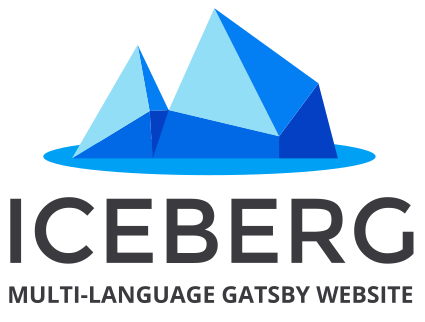

[](https://gitpod.io/#https://github.com/diogorodrigues/iceberg-gatsby-multilang) 



# Gatsby multi-language starter with CMS

[Demo on Netlify](https://iceberg-gatsby-multilang.netlify.com/)

[Starter on Gatsby](https://www.gatsbyjs.org/starters/diogorodrigues/iceberg-gatsby-multilang/)

A starter Internationalization / i18n without third party plugins or packages for Posts and Pages. Different URLs dependending on the language. Focused on SEO, PWA, Image Optimization, Styled Components and more. This starter is also integrate with Netlify CMS to manage all pages, posts and images.

-   Translations by using GraphQL, hooks and context API
-   Content in markdown for pages and posts in different languages
-   General translations for any content
-   Creation of menus by using, jSON, translations and GraphQL
-   Netlify CMS to manage all pages, posts and images
-   Styled Components to styles
-   All important seetings for speedy and optimized images
-   Blog Posts list with pagination
-   Focus on SEO
-   PWA

## 🚀 Getting Started

Assuming [Gatsby](https://github.com/gatsbyjs/gatsby/) is installed, run the following commands to install the project:

**With gatsby-cli**:
```
$ gatsby new gatsby-multilanguage-site https://github.com/diogorodrigues/iceberg-gatsby-multilang.git
```

**With git clone**:
```
$ git clone https://github.com/diogorodrigues/iceberg-gatsby-multilang.git your-project-name # Clone the project

cd your-project-name

rm -rf .git
yarn install # or npm install
gatsby develop # or yarn run develop
```


Running `gatsby develop` you will see the following URLs:

```
http://localhost:8000
http://localhost:8000/___graphql
http://localhost:8000/admin
```

## File Structure

A quick look at the top-level files and directories you'll see in a Gatsby project.

```
├── blog
│   ├── markdown-file.en.md
│   ├── markdown-file.pt.md
├── config
│   ├── language-mapping
│   ├── menu
│   │   ├── en.json
│   │   ├── pt.json
│   ├── translations
│   │   ├── en.json
│   │   ├── pt.json
│   ├── i18n.js
├── pages
│   ├── markdown-file.en.md
│   ├── markdown-file.pt.md
├── src
├── static
│   ├── admin
│   │   ├── config.yml
│   ├── assets
│   │   ├── img
├── gatsby-browser.js
├── gatsby-config.js
├── gatsby-node.js
├── gatsby-ssr.js
├── wrapPageElement.js

```

1. **blog and pages directories**:
   All markdown files to generate pages and posts.

2. **config**:
   All language settings: languages, strings, menu...
   In `i18n.js` you can set the languages and some others important info

3. **src**:
   Components, hooks, templates and fixed pages (Different of markdown pages, these pages have the same url for all languages and the text content needs to be inserted in `config/translations` files).

4. **static**:
   Netlify settings and images.

5. **gatsby-browser.js**:
   External files and the layout wrapper setting.

6. **gatsby-config.js**:
   Gatsby plugins.

7. **gatsby-node.js**:
   Logic for generating pages and posts by manipulating GraphQL.

8. **wrapPageElement.js**
   As this component wraps every page (due to the wrapPageElement API) we can be sure to have the locale available everywhere!

## About Netlify CMS

You must change the Netlify data "repo" and "site_domain" according your Github repository in `static/admin/config.yml`.

```
backend:
    name: github # Local
    # name: git-gateway # Prod
    repo: _owner-name/repo-name_ # Path to your GitHub repository
    branch: master
    site_domain: _site-url_ # If site extists
```

Realize that you need to use `name: github` for local development and `name: git-gateway` for prod environment (netlify)

## Important notes:

-   General information for languages are defined in `config/i18n.js`.
-   The general content translations are located in `config/translations` and the `useTranslations` custom hook pulls these translations (via GraphQL query) and inserts them into the pages.
-   The menu items translations are located in `config/menu` and the `useMenu` custom hook pulls these translations (via GraphQL query) and inserts them into the pages.
-   **✨ New**: Adding corresponding urls are locating in `config/language-mapping` and the `useLanguageMapping` custom hook pulls these translations (via GraphQL query) and inserts them into the pages. It is used together with the language switcher so that the page is directed to a page corresponding to the other language.
-   Due to the use of a global layout / context API and the language code passed to all pages (see `gatsby-node.js`), you know on all pages which language is currently displayed.
-   Blogposts are defined in `blog` directory and pages are defined in `pages` directory. The file names are the `slug` of the posts and pages.
-   A custom component for the <a> tag is implemented - this way links can stay the same for every language, without the need to manually write path prefixes.

## Deploy

<a href="https://app.netlify.com/start/deploy?repository=https://github.com/diogorodrigues/iceberg-gatsby-multilang" rel="nofollow"></a>

---

💜 _Thanks_

---

This project started based on [this solution](https://github.com/gatsbyjs/gatsby/tree/master/examples/using-i18n) to create a manner to provide translations, but I added a lots of other solutions based on my projects needs (like menu from GraphQL, markdown for pages, pagination, image optmization, styled components, PWA, CMS and more). Feel free to use this solution if you want. :)
